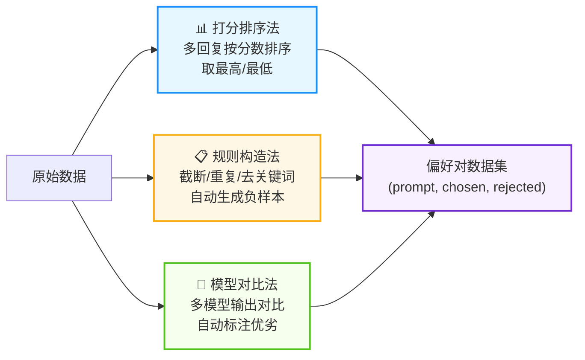
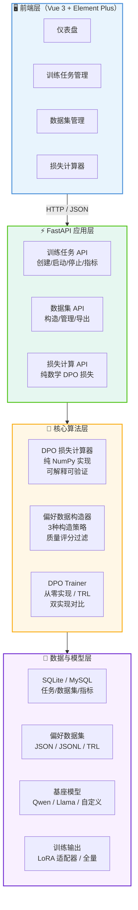

<div align="center">

# 🎯 DPO 微调一站式平台

**DPO FineTune Platform**

从零实现 DPO 直接偏好优化 + 偏好数据构造 + 领域微调全流程管理平台

[](https://www.python.org/)
[](https://fastapi.tiangolo.com/)
[](https://pytorch.org/)
[](https://vuejs.org/)
[](LICENSE)

</div>

---

## 📑 目录

<details>
<summary><strong>点击展开/收起目录</strong></summary>

- [✨ 核心技术亮点](#-核心技术亮点)
- [🏗️ 系统架构](#️-系统架构)
- [🔧 核心模块详解](#-核心模块详解)
- [📦 技术栈选型](#-技术栈选型)
- [🗄️ 数据库设计](#️-数据库设计)
- [🌐 API 接口设计](#-api-接口设计)
- [🚀 快速开始](#-快速开始)
- [📁 项目结构](#-项目结构)
- [🔮 后续演进方向](#-后续演进方向)
- [📄 License](#-license)

</details>

---

## ✨ 核心技术亮点

### 1️⃣ 从零实现 DPO 算法（纯数学可验证）

| 维度 | 说明 |
|---|---|
| 📐 **核心公式** | L_DPO = -E[log σ(β (log π(y_w|x)/π_ref(y_w|x) - log π(y_l|x)/π_ref(y_l|x)))] |
| 🧮 **损失计算器** | 纯 NumPy 实现，输入 log 概率即可计算损失/奖励/准确率，无需 GPU |
| 📊 **指标可视化** | 损失曲线、奖励边际、隐式奖励实时监控 |
| 🔬 **可解释性** | 每步输出 chosen/rejected log ratio、隐式奖励、准确率 |

> **技术难点**：DPO 跳过奖励模型训练，直接用偏好对优化策略，数学推导复杂。本项目提供纯数学实现，便于理解原理和调试。

### 2️⃣ 三种偏好数据自动构造策略



- ✅ **打分排序法**：适合有人工/模型打分的多回复场景
- ✅ **规则构造法**：零标注成本，适合只有单轮问答数据的冷启动场景
- ✅ **模型对比法**：适合有多个模型输出，自动对比质量构造偏好

### 3️⃣ 双实现对比（从零实现 vs TRL 库）

| 实现方式 | 优势 | 适用场景 |
|---|---|---|
| 🔬 **从零实现** | 完全可控、可解释、可定制、便于学习原理 | 研究、教学、定制化需求 |
| 🏭 **TRL 库** | 生产级、分布式支持、优化充分、生态完善 | 生产部署、大规模训练 |

> 平台支持两种实现，可对比训练效果，选择最优方案。

### 4️⃣ 训练全流程可视化管理

- 📋 **任务管理**：创建/启动/停止/删除训练任务，状态实时跟踪
- 📈 **指标监控**：损失曲线、奖励边际、隐式奖励、学习率实时可视化
- 📊 **多格式导出**：JSON / JSONL / TRL 格式一键导出
- 🔍 **质量评分**：自动评估偏好对质量，过滤低质量样本

---

## 🏗️ 系统架构



---

## 🔧 核心模块详解

### 📐 DPO 损失计算器 (`app/core/dpo_trainer.py`)

**核心公式实现：**

```python
def compute_loss(self, policy_chosen_logps, policy_rejected_logps,
                 ref_chosen_logps, ref_rejected_logps):
    # log π(y|x) - log π_ref(y|x)
    chosen_logratios = policy_chosen_logps - ref_chosen_logps
    rejected_logratios = policy_rejected_logps - ref_rejected_logps

    # L_DPO = -log σ(β (logratio_chosen - logratio_rejected))
    logits = self.beta * (chosen_logratios - rejected_logratios)
    losses = -np.log(self._sigmoid(logits) + 1e-8)

    # 隐式奖励 = β * logratio
    chosen_rewards = self.beta * chosen_logratios
    rejected_rewards = self.beta * rejected_logratios
    reward_margin = chosen_rewards - rejected_rewards
```

**输出指标：**

| 指标 | 含义 | 理想趋势 |
|---|---|---|
| `loss` | DPO 损失 | ↓ 持续下降 |
| `chosen_rewards` | Chosen 隐式奖励 | ↑ 上升 |
| `rejected_rewards` | Rejected 隐式奖励 | ↓ 下降或平稳 |
| `reward_margin` | 奖励边际（chosen - rejected） | ↑ 持续增大 |
| `accuracy` | Chosen > Rejected 的比例 | ↑ 接近 1.0 |

### 📊 偏好数据构造器 (`app/core/preference_builder.py`)

**三种构造策略对比：**

| 策略 | 输入格式 | 标注成本 | 数据质量 | 适用场景 |
|---|---|---|---|---|
| **打分排序** | prompt + 多回复+分数 | 中（需打分） | 高 | 有模型/人工打分 |
| **规则构造** | 问答对（QA） | 零 | 中 | 冷启动、无标注 |
| **模型对比** | prompt + 多模型输出 | 低（自动对比） | 中高 | 多模型评测场景 |

**质量评分维度：**
- 非空检查（30%）
- 长度差异（20%）
- 内容不完全相同（30%）
- 合理长度（20%）

### 🏋️ DPO Trainer (`app/core/dpo_trainer.py`)

**训练配置参数：**

| 参数 | 默认值 | 说明 |
|---|---|---|
| `beta` | 0.1 | 温度系数，控制与参考模型偏离程度 |
| `learning_rate` | 5e-5 | 学习率 |
| `num_epochs` | 3 | 训练轮数 |
| `batch_size` | 4 | 批次大小 |
| `max_length` | 1024 | 最大序列长度 |
| `warmup_ratio` | 0.1 | 预热比例 |
| `weight_decay` | 0.01 | 权重衰减 |
| `gradient_accumulation_steps` | 1 | 梯度累积步数 |
| `max_grad_norm` | 1.0 | 梯度裁剪 |

---

## 📦 技术栈选型

| 分类 | 技术选型 | 选型原因 |
|---|---|---|
| 🚀 后端框架 | **FastAPI** | 异步高性能、自动生成 OpenAPI 文档、Pydantic 类型校验 |
| 🧠 深度学习 | **PyTorch** | 生态最成熟、DPO/RLHF 研究首选、灵活可定制 |
| 📚 微调库 | **PEFT + TRL** | 参数高效微调（LoRA/QLoRA）、DPO 官方实现、生产级优化 |
| 📊 数据处理 | **Pandas + NumPy** | 数据清洗、统计分析、损失计算 |
| 🎨 前端 | **Vue 3 + Element Plus** | 组件化开发、企业级 UI 组件、适合管理后台 |
| 📈 可视化 | **ECharts** | 训练曲线、损失监控、奖励边际可视化 |
| 💾 数据库 | **SQLite + MySQL** | 开发用 SQLite 零配置，生产用 MySQL |
| ⚡ 异步任务 | **Celery + Redis** | 训练任务异步执行、状态跟踪、结果缓存 |
| 🧪 测试 | **pytest** | 单元测试、损失函数验证、数据构造测试 |

<details>
<summary><strong>❓ 为什么用 DPO 而不是 RLHF？</strong></summary>

- **更简单**：DPO 跳过奖励模型训练，直接用偏好对优化策略，训练流程更简单
- **更稳定**：DPO 训练更稳定，超参数更敏感但调参空间更小
- **成本更低**：不需要训练奖励模型，计算成本约为 RLHF 的 1/3
- **效果相当**：在多数场景下 DPO 效果与 RLHF 相当甚至更好
- **可解释**：损失函数有明确的数学含义，便于分析和调试

</details>

---

## 🗄️ 数据库设计

### training_jobs（训练任务表）

| 字段 | 类型 | 说明 |
|---|---|---|
| `id` | BIGINT | 主键 |
| `job_name` | VARCHAR(256) | 任务名称 |
| `status` | VARCHAR(32) | 状态（pending/running/completed/failed） |
| `model_name` | VARCHAR(256) | 基座模型名称 |
| `dataset_path` | VARCHAR(512) | 偏好数据集路径 |
| `config_json` | TEXT | 训练配置（JSON） |
| `output_dir` | VARCHAR(512) | 输出目录 |
| `final_loss` | FLOAT | 最终损失 |
| `final_reward_margin` | FLOAT | 最终奖励边际 |
| `epochs_trained` | INT | 已训练轮数 |
| `steps_trained` | INT | 已训练步数 |
| `error_message` | TEXT | 错误信息 |
| `created_at` | DATETIME | 创建时间 |
| `started_at` | DATETIME | 启动时间 |
| `completed_at` | DATETIME | 完成时间 |

### training_metrics（训练指标表）

| 字段 | 类型 | 说明 |
|---|---|---|
| `id` | BIGINT | 主键 |
| `job_id` | BIGINT | 关联任务 ID |
| `step` | INT | 训练步数 |
| `epoch` | INT | 训练轮数 |
| `loss` | FLOAT | DPO 损失 |
| `chosen_reward` | FLOAT | Chosen 隐式奖励 |
| `rejected_reward` | FLOAT | Rejected 隐式奖励 |
| `reward_margin` | FLOAT | 奖励边际 |
| `learning_rate` | FLOAT | 学习率 |
| `created_at` | DATETIME | 记录时间 |

### preference_datasets（偏好数据集表）

| 字段 | 类型 | 说明 |
|---|---|---|
| `id` | BIGINT | 主键 |
| `name` | VARCHAR(256) | 数据集名称 |
| `description` | TEXT | 描述 |
| `file_path` | VARCHAR(512) | 文件路径 |
| `format` | VARCHAR(32) | 格式（json/jsonl/trl） |
| `num_samples` | INT | 样本数量 |
| `build_strategy` | VARCHAR(64) | 构造策略 |
| `avg_prompt_length` | FLOAT | 平均 Prompt 长度 |
| `avg_chosen_length` | FLOAT | 平均 Chosen 长度 |
| `avg_rejected_length` | FLOAT | 平均 Rejected 长度 |
| `created_at` | DATETIME | 创建时间 |

---

## 🌐 API 接口设计

### 🏋️ 训练任务接口

| 方法 | 路径 | 说明 |
|---|---|---|
| `GET` | `/api/training/jobs` | 训练任务列表（状态筛选+分页） |
| `GET` | `/api/training/jobs/{id}` | 任务详情 |
| `POST` | `/api/training/jobs` | 创建训练任务 |
| `POST` | `/api/training/jobs/{id}/start` | 启动训练 |
| `POST` | `/api/training/jobs/{id}/stop` | 停止训练 |
| `GET` | `/api/training/jobs/{id}/metrics` | 训练指标曲线 |
| `DELETE` | `/api/training/jobs/{id}` | 删除任务 |

### 📊 数据集接口

| 方法 | 路径 | 说明 |
|---|---|---|
| `GET` | `/api/dataset/datasets` | 数据集列表 |
| `GET` | `/api/dataset/datasets/{id}` | 数据集详情 |
| `POST` | `/api/dataset/datasets/build` | 构造偏好数据集 |
| `POST` | `/api/dataset/datasets/{id}/export/{fmt}` | 导出为指定格式 |
| `DELETE` | `/api/dataset/datasets/{id}` | 删除数据集 |

### 📐 损失计算接口

| 方法 | 路径 | 说明 |
|---|---|---|
| `POST` | `/api/dataset/loss/compute` | DPO 损失计算（纯数学，无需 GPU） |

---

## 🚀 快速开始

### 📋 环境要求

- Python 3.10+
- PyTorch 2.1+（GPU 可选，CPU 可运行损失计算和数据构造）
- Redis（可选，用于异步训练任务）

### 💻 本地开发

```bash
# 1. 克隆项目
git clone <repo-url>
cd M9T-DPO-FineTune-Platform

# 2. 创建虚拟环境
python -m venv .venv
.venv\Scripts\activate  # Windows
# source .venv/bin/activate  # Linux/Mac

# 3. 安装依赖
pip install -r requirements.txt

# 4. 配置环境变量
cp .env.example .env

# 5. 启动后端
uvicorn app.main:app --reload --port 8000

# 6. 启动前端（新开终端）
cd admin
npm install
npm run dev
```

### 🌐 访问

| 页面 | 地址 |
|---|---|
| 🎨 管理后台 | http://localhost:5175 |
| 📖 API 文档 | http://localhost:8000/docs |
| 💚 健康检查 | http://localhost:8000/healthz |

### 🧪 快速验证 DPO 损失计算

```bash
curl -X POST http://127.0.0.1:8000/api/dataset/loss/compute \
  -H "Content-Type: application/json" \
  -d '{
    "policy_chosen_logps": [-2.5, -3.1, -1.8],
    "policy_rejected_logps": [-4.2, -3.8, -5.1],
    "ref_chosen_logps": [-2.8, -3.0, -2.0],
    "ref_rejected_logps": [-4.0, -3.5, -4.8],
    "beta": 0.1
  }'
```

---

## 📁 项目结构

```
M9T-DPO-FineTune-Platform/
├── app/                          # 🎯 应用主目录
│   ├── main.py                   # FastAPI 主应用
│   ├── config.py                 # ⚙️ 配置中心
│   ├── core/                     # 🧠 核心算法
│   │   ├── dpo_trainer.py        # DPO 损失计算 + 训练器 + 指标分析
│   │   └── preference_builder.py # 偏好数据构造器（3种策略）
│   ├── api/                      # 🌐 API 路由
│   │   ├── training.py           # 训练任务 API
│   │   └── dataset.py            # 数据集 + 损失计算 API
│   ├── models/                   # 💾 数据库模型
│   │   └── database.py           # SQLAlchemy 模型 + 会话管理
│   ├── schemas/                  # 📊 Pydantic 数据模型
│   │   └── models.py             # 请求/响应校验
│   ├── services/                 # 🔧 业务服务
│   └── workers/                  # ⚡ 异步任务（Celery）
├── admin/                        # 🎨 前端管理后台
│   ├── src/
│   │   ├── views/
│   │   │   ├── Dashboard.vue     # 📊 仪表盘
│   │   │   ├── TrainingJobs.vue  # 🏋️ 训练任务管理
│   │   │   ├── DatasetManage.vue # 📊 数据集管理
│   │   │   └── LossCalculator.vue# 📐 DPO 损失计算器
│   │   ├── api/index.js          # API 封装
│   │   ├── router.js             # 路由配置
│   │   ├── App.vue               # 布局组件
│   │   └── main.js               # 应用入口
│   ├── vite.config.js
│   └── package.json
├── data/                         # 📊 数据目录
│   ├── datasets/                 # 偏好数据集
│   ├── preferences/              # 原始偏好数据
│   └── outputs/                  # 训练输出
├── deploy/                       # 🚀 部署相关
├── scripts/                      # 🔧 运维脚本
├── tests/                        # 🧪 测试目录
├── docs/                         # 📚 文档
├── requirements.txt              # 📦 Python 依赖
├── .env.example                  # ⚙️ 环境变量示例
└── README.md                     # 📖 项目说明
```

---

## 🔮 后续演进方向

### 📅 短期（1-3个月）

- [ ] 集成 LoRA/QLoRA 参数高效微调
- [ ] 支持分布式训练（DeepSpeed / Accelerate）
- [ ] 增加 RLHF 对比实现（PPO）
- [ ] 训练过程实时日志推送（WebSocket）

### 📅 中期（3-6个月）

- [ ] 偏好数据自动标注（用强模型打分）
- [ ] 多任务适配器融合与切换
- [ ] 模型评测基准集成（MMLU / C-Eval / 领域 benchmark）
- [ ] 训练实验对比与版本管理

### 📅 长期（6-12个月）

- [ ] 在线学习（持续从用户反馈中构造偏好对）
- [ ] 多模态偏好优化（图文/视频）
- [ ] 联邦学习场景下的 DPO
- [ ] 自动化超参数搜索（贝叶斯优化）

---

## 📄 License

[MIT](LICENSE)

---

<div align="center">

**如果这个项目对你有帮助，欢迎给个 ⭐ Star 支持！**

</div>
